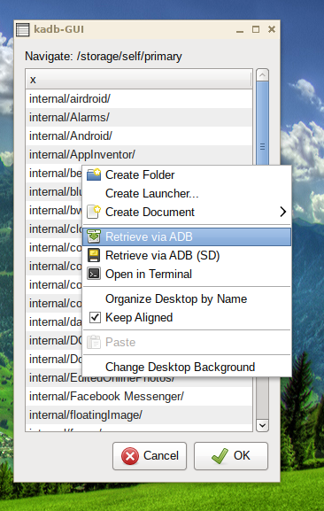

# kadb

USAGE: kadb [SOURCE] [DEST]
- Note: supports globbing; need to change the path to the SDcard

### Caja Actions ###

- Note: need to change the executable location and the path to the SDcard

### Prerequisites
* adb (android-tools)
* Caja file manager (mate)
* zenity

### Installation
1. Save `kadb` and `kadb-select` to `/opt/bin`
2. Import the 3 .desktop files into Caja Actions Configuration Tool
3. Adjust paths as needed
